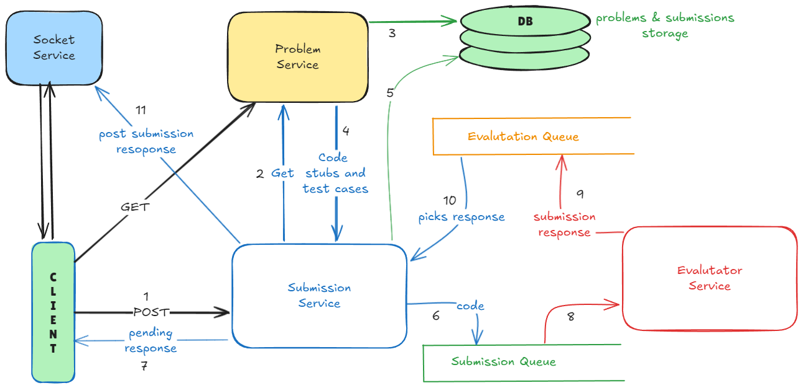

# 🚀 LeetCode Clone Backend — Microservices Architecture

<table>
<tr>
<td>

A production-style **LeetCode-like coding platform backend** built using a scalable microservices architecture.

</td>
<td align="right">

### 🔗 Repositories

- [Problem-Service](https://github.com/Sourabh-km13/Problem_service)
- [Submission-Service](https://github.com/Sourabh-km13/Submission-Service)
- [Evaluator-Service](https://github.com/Sourabh-km13/Evaluator-Service)
- [Socket-Service](https://github.com/Sourabh-km13/Socket-Service)

</td>
</tr>
</table>

---

## 🏗️ Architecture Diagram

> High-level system flow and service interaction

> Make sure you add your architecture image file as `architecture.png` in the root of this repository.

---

## 🚀 Architecture Highlights

- **Docker-based execution sandboxing** for running user code safely in isolated JVM, Node, and GNU environments  
- **Asynchronous evaluation pipeline** using Redis Bullmq for inter-service messaging queues  
- **Real-time updates** via WebSockets (Socket.IO)   
- **Clear separation of concerns using microservices** across Problem, Submission, Evaluator, and Socket services  
- **High-performance backend using Fastify** for handling high concurrency and low latency  
- **Scalable architecture with MVC layering & Strategy Pattern** for clean separation of concerns and extensibility  
- **Type-safe codebase with TypeScript** to reduce runtime errors and improve maintainability  
- **Centralized error handling middleware** with custom `BaseError` and standardized API responses  
- **DTO-based validation using Zod** for strict input validation and runtime type safety  

---

## 📌 System Overview

The backend consists of four independent services:

| Service | Responsibility |
|----------|---------------|
| **Problem-Service** | Manages coding problems and metadata |
| **Submission-Service** | Tracks and manages submission lifecycle |
| **Evaluator-Service** | Executes and evaluates user code |
| **Socket-Service** | Handles real-time communication |

---

## 🔁 Execution Flow

1. Client fetches problem from **Problem-Service**
2. Client submits solution → **Submission-Service**
3. Submission stored and client sees  `Pending`
4. Submission published to Redis submission queue
5. **Evaluator-Service** consumes job asynchronously
6. Code executed inside Docker container
7. Results pushed to Evaluation queue
8. Submission service works on evalutation queue 
9. submission status updated in database and a post request of status sent to socket-service.
10. **Socket-Service** pushes real-time update to client

---

## 🛠 Tech Stack

**Backend**
- Node.js
- Express.js
- Fastify
- TypeScript, Javascript

**Execution**
- Docker (isolated code sandbox)

**Database & Messaging**
- MongoDb, Mongoose
- Redis , BullMq

**Real-Time**
- Socket.IO

## 👨‍💻 Author

**Sourabh Kumar**  
GitHub: https://github.com/Sourabh-km13
